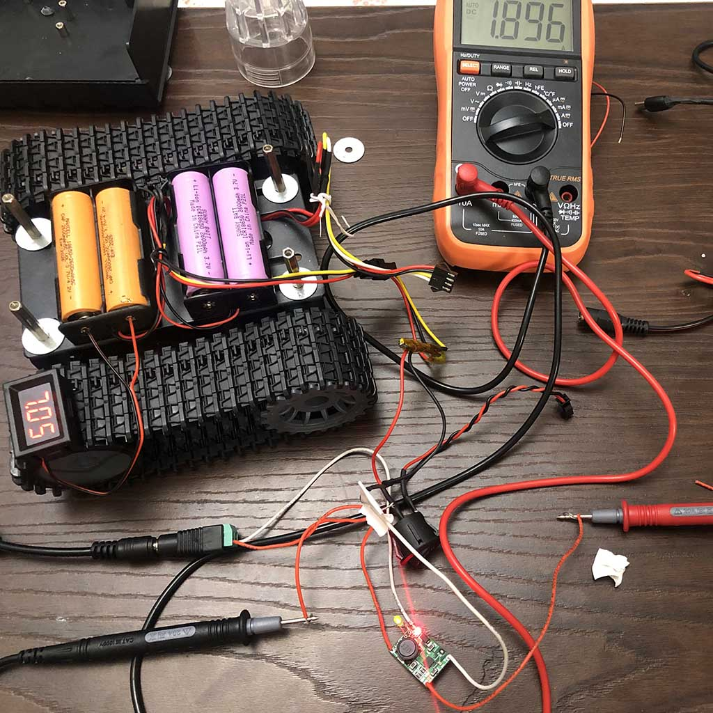
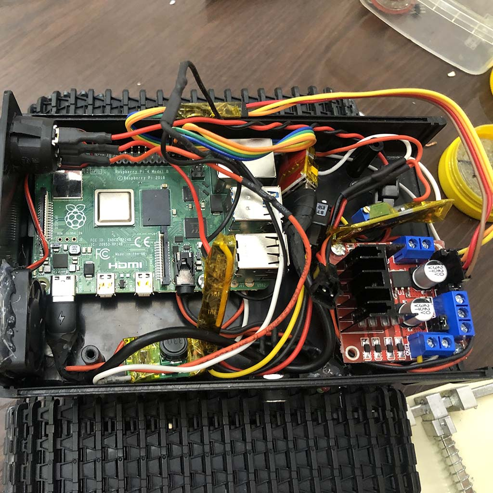
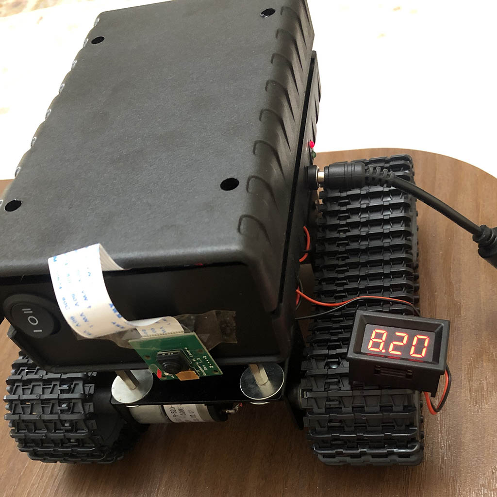
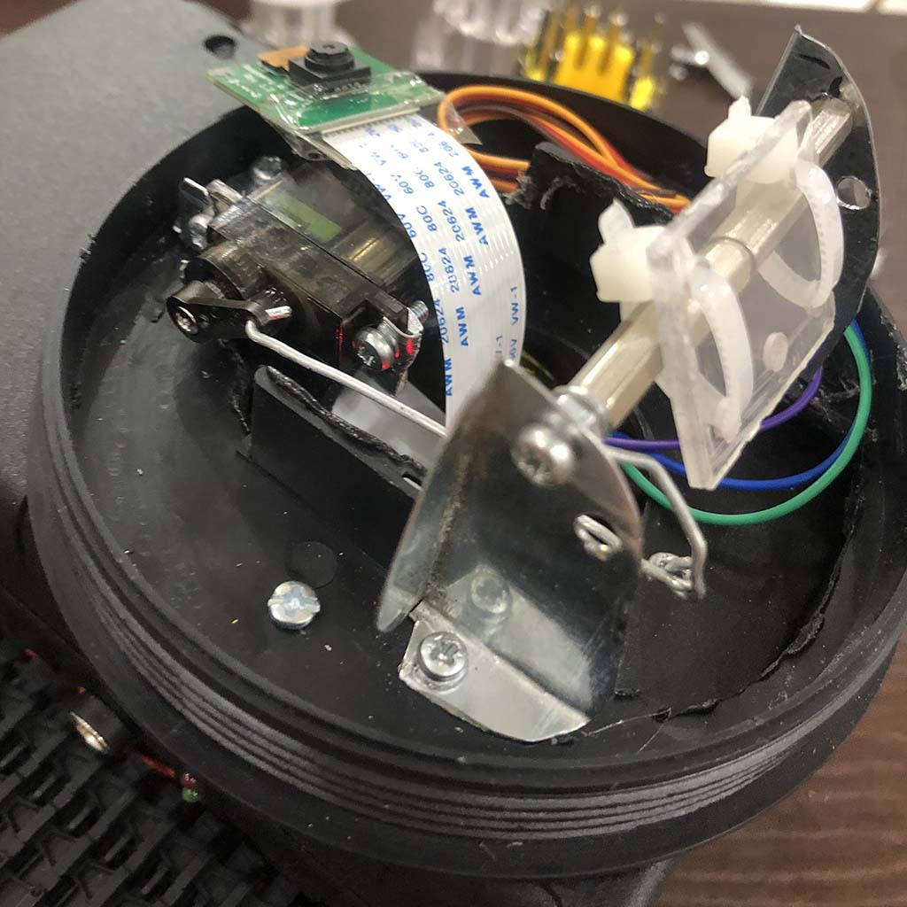
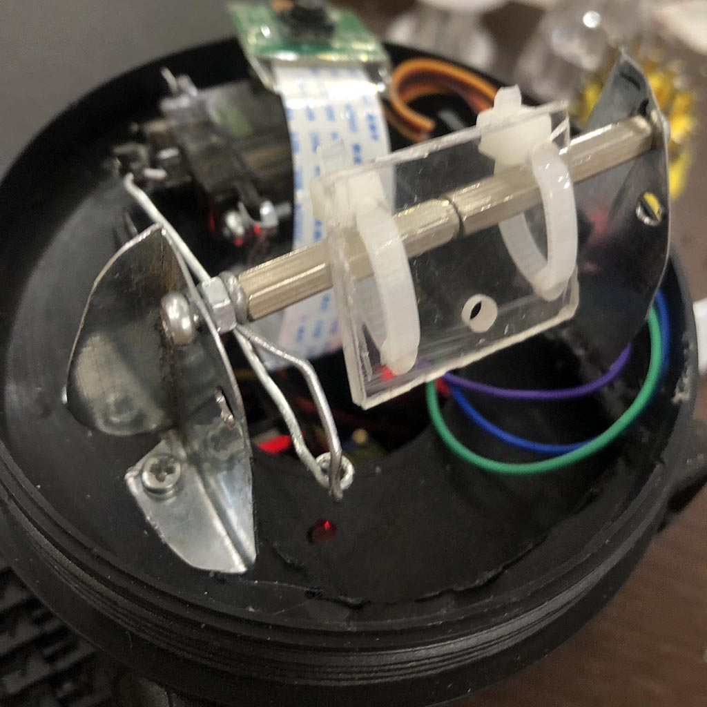
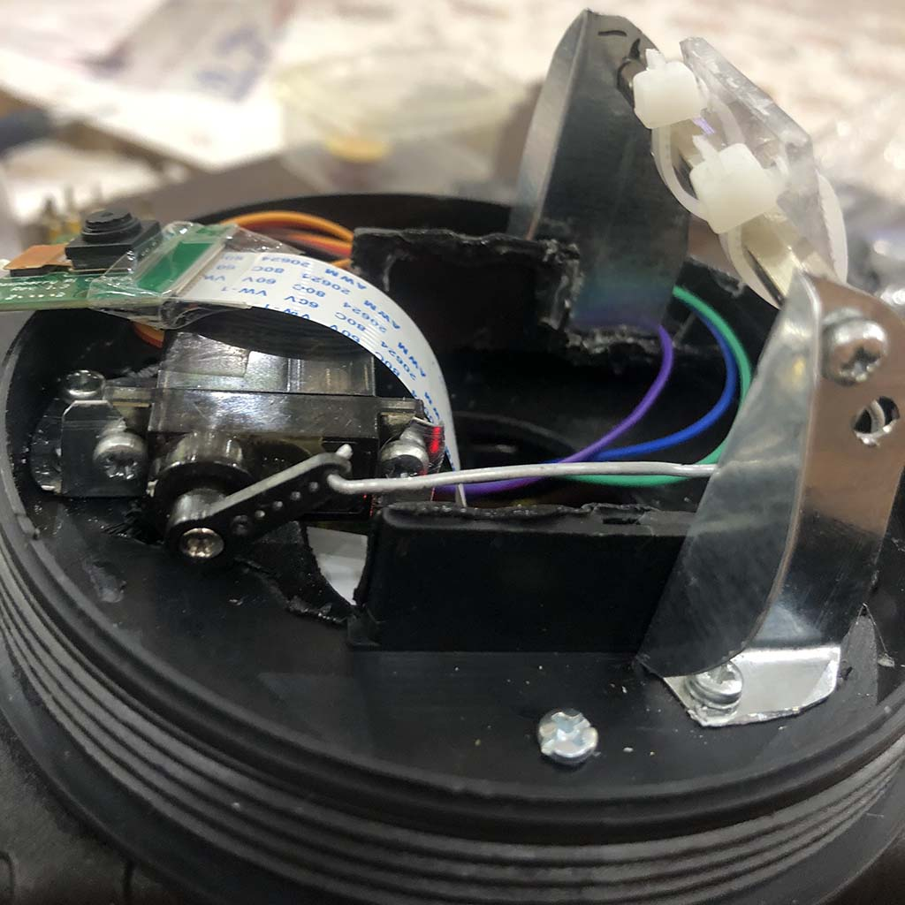

### :mag_right: Overview
Here is a complete guide about how to make the remote tank 
chassis robot platform using the modules & hardwares.
If you are going to make one, Please observe safety while working! If you have any question, Feel free and ask me through 
email or **Gihub Issues**.

### :electric_plug:	 Hardwares & Modules
The list below, includes all necessary modules and hardwares to make the robot and the  
design depended parts were ignored in this list. 
- 1 x Tank chassis with 2 DC motors 
- 1 x Raspberry PI 4
- 1 x Raspberry PI camera (OV5647)
- 1 x L298 motor driver controller module
- 1 x SG90 Servo motor
- 1 x HX-2S-10 Series Li-ion battery managment system (BMS) module
- 1 x TP-5100 Series Li-ion battery charger module
- 2 x 5V-2A DC/DC Step-down voltage converter module (MP1584EN, MINI-360 ...)
- 1 x 2A DC/DC Boost voltage converter module (MT3608 Module)
- 4 x Li-ion 18650 battery (~2600mah)
- 1 x USB to Type-C cable
- 1 x Two way electric switch 

### :heavy_check_mark: Step 1 : Tank Chassis & Batteries Setup
At the first step, Connect the batteries to HX-2S
module and connect HX-2S module input to TP-5100 ouput solders, and make sure you are using the **same capacity** and **same brand** batteries,  That the batteries voltage should be almost same when you series them (Maximum -/+ 0.02 volt difference). These points are very important.

### :heavy_check_mark: Step 2 : Connecting RPI to BMS & L298 module

### :heavy_check_mark: Step 3 : Test robot cover case

### :heavy_check_mark: Step 4 : Connect camera case

